# Diseño Preliminar — Plataforma ATS de Nueva Generación
**Senior Product Manager Report · Mayo 2026**

> **North Star:** "El ATS que hace que contratar sea tan fluido para el equipo interno como hacer un pedido online, y tan transparente para el candidato como rastrear un envío."

---

## 1. Descripción del Software

Esta plataforma es un **Applicant Tracking System (ATS) de nueva generación** diseñada para empresas de 50 a 5.000 empleados que necesitan contratar mejor, más rápido y con menos fricción interna. A diferencia de los sistemas tradicionales —concebidos como bases de datos de candidatos con flujos de aprobación— esta plataforma está construida desde cero con tres principios irrenunciables: la experiencia del candidato como ventaja competitiva, la adopción del hiring manager como condición de diseño, y la inteligencia artificial como motor de ejecución real (no como feature de marketing).

La plataforma cubre el ciclo completo de adquisición de talento: desde la creación de la vacante y la publicación multicanal, hasta la coordinación de entrevistas, la toma de decisión colaborativa, la generación de la oferta y el traspaso al HRIS corporativo. Todo ello en una interfaz que el recruiter usa a diario con fluidez, que el hiring manager puede operar desde el móvil en 30 segundos, y que el candidato experimenta como el proceso de selección más transparente y respetuoso que ha vivido.

**Contexto de mercado:**

| Métrica | Valor |
|---|---|
| Mercado global ATS 2025 | $3.1B |
| CAGR proyectado 2026–2034 | 8.1% |
| Fortune 500 que usa un ATS | 97.8% |
| Recruiters frustrados con su ATS actual | 68% |

> **Fuentes:** Grand View Research, *Applicant Tracking System Market Report 2025*; Gartner, *Talent Acquisition Technology Market Guide 2025*; SelectSoftware Reviews, *ATS Statistics & Trends 2026*; G2, *ATS Grid Report Spring 2026*; LinkedIn, *Global Talent Trends 2025*.

---

## 2. Análisis de los 3 ATS Más Relevantes del Mercado

### 2.1 Greenhouse
**Segmento:** Mid-market y enterprise · **Rating G2 2026:** 4.4/5 · **+7.500 empresas clientes**

| Dimensión | Puntuación |
|---|---|
| UX / Usabilidad | 88/100 |
| Structured hiring | 92/100 |
| Integraciones | 80/100 |
| Analytics | 70/100 |
| Precio-valor | 60/100 |

**Fortalezas:** Mejor UX del mercado enterprise con interfaz intuitiva y bien diseñada. Structured hiring nativo con scorecards predefinidos. Marketplace de +500 integraciones. Greenhouse AI lanzado en septiembre 2025 con resumen automático de candidatos.

**Limitaciones críticas:** Precio elevado y proceso de ventas opaco sin precios públicos. Reporting básico sin personalización avanzada. Sincronización HRIS parcial: transfiere solo campos básicos (no compensación ni códigos de posición). Implementación compleja que requiere consultores externos.

---

### 2.2 iCIMS Talent Cloud
**Segmento:** Enterprise · **Rating G2:** 4.2/5 · **~4.000 empresas clientes** · Adquirió Apli en 2025

| Dimensión | Puntuación |
|---|---|
| UX / Usabilidad | 65/100 |
| Structured hiring | 78/100 |
| Integraciones | 95/100 |
| Analytics | 75/100 |
| Precio-valor | 50/100 |

**Fortalezas:** ~800 integraciones disponibles — el ecosistema más grande del mercado ATS. Automatización de workflows avanzada con motor de reglas configurable. API robusta y bien documentada. Conectores enterprise nativos con Workday, ADP, SAP, UKG y Oracle HCM.

**Limitaciones críticas:** Implementación lenta y extremadamente compleja: 6–18 meses promedio. UX anticuada con curva de aprendizaje alta. Soporte al cliente inconsistente. Modelo de pricing exclusivamente enterprise — inaccesible para PYMEs.

---

### 2.3 Workday Recruiting
**Segmento:** Enterprise HCM suite · **Rating G2:** 4.0/5 · **+10.000 empresas Workday** · Absorbió Paradox en 2025

| Dimensión | Puntuación |
|---|---|
| UX / Usabilidad | 60/100 |
| Structured hiring | 70/100 |
| Integraciones | 85/100 |
| Analytics | 90/100 |
| Precio-valor | 45/100 |

**Fortalezas:** Suite HCM unificada con HRIS nativo — eliminación total de silos de datos. Analytics y reporting avanzado con People Analytics integrado. IA conversacional vía adquisición de Paradox en 2025. Movilidad interna nativa.

**Limitaciones críticas:** UX rígida y frustrante para recruiters de uso diario. Implementación de 6 a 18 meses con equipos de consultoría especializados. Costo total de propiedad muy elevado. Parsing de CVs deficiente que obliga a candidatos a rellenar campos manualmente.

---

### 2.4 Dolores Identificados — Ordenados por Impacto de Negocio

**#1 — Pérdida de candidatos cualificados por UX deficiente** ░░ Impacto: 96%
El 60% de candidatos abandona aplicaciones que consideran largas o complejas. El 69% abandona cuando el ATS falla al parsear su CV. Los mejores perfiles no toleran fricciones técnicas.
*Impacto: Directo en revenue · Daño al employer brand · Posiciones vacías más tiempo*

**#2 — Baja adopción de hiring managers → feedback tardío** ░░ Impacto: 90%
Los HMs encuentran el sistema complejo y lo evitan. El pipeline se paraliza, los candidatos esperan semanas sin respuesta y terminan aceptando otras ofertas.
*Impacto: Alarga time-to-hire 5–15 días · Candidatos perdidos · Frustra al equipo de recruiting*

**#3 — Comunicación deficiente con candidatos** ░░ Impacto: 85%
El 52% cita la falta de comunicación como su mayor frustración. Solo el 10% cree que sus aplicaciones son revisadas por alguien real. Los rechazos llegan tarde o nunca.
*Impacto: Destrucción del employer brand · Candidatos que ghostean a la empresa*

**#4 — Integración HRIS incompleta y sincronización parcial** ░░ Impacto: 78%
Incluso los ATS líderes sincronizan solo campos básicos. Esto obliga a trabajo manual post-contratación de 3–5 horas por hire, duplica errores y consume tiempo de RRHH.
*Impacto: Ineficiencia operacional · Datos inconsistentes · Riesgo de compliance*

**#5 — Reporting limitado y dashboards no accionables** ░░ Impacto: 72%
Los paneles estándar son superficiales. Cualquier métrica personalizada requiere exportar a Excel. Los líderes de TA no pueden demostrar ROI ni identificar cuellos de botella.
*Impacto: Decisiones sin datos · TA no puede influir estratégicamente en el negocio*

**#6 — Pricing opaco que penaliza el crecimiento** ░░ Impacto: 65%
Los ATS líderes han migrado funcionalidades incluidas a tiers de pago o add-ons. Las empresas en crecimiento ven saltar su factura sin cambios en el producto.
*Impacto: Impacto presupuestario directo · Fricción en renovaciones anuales*

**#7 — Workflows rígidos que no se adaptan a procesos únicos** ░░ Impacto: 55%
Las organizaciones deben doblar sus procesos reales para encajar en la estructura del ATS. Genera burocracia interna y bajas tasas de adopción.

**#8 — Burnout de equipos de TA por falta de automatización real** ░░ Impacto: 45%
El 27% de equipos de TA reporta burnout. Los ATS actuales automatizan superficialmente pero dejan sin resolver la coordinación de entrevistas, seguimiento y actualización de estados.

---

## 3. Diferenciadores para un ATS Superior

### 3.1 Valor Añadido

El valor central que entrega la plataforma se articula en cuatro ejes:

**Reducción del time-to-hire.** Al eliminar el cuello de botella de la adopción de hiring managers y automatizar la coordinación de entrevistas, las empresas que adoptan la plataforma reducen su tiempo promedio de contratación en un 30% desde el primer mes. Cada día que una posición clave permanece vacante tiene un costo directo en productividad y oportunidad.

**Employer brand como activo estratégico.** El 52% de los candidatos cita la comunicación deficiente como su mayor frustración con los procesos de selección actuales. Esta plataforma convierte cada interacción con un candidato —incluyendo los rechazos— en una experiencia positiva y recordada. Los candidatos que viven un proceso transparente recomiendan la empresa aunque no consigan el trabajo, generando un ciclo de atracción de talento orgánico y sostenible.

**TA como función estratégica, no administrativa.** Los equipos de Talent Acquisition que usan esta plataforma acceden a analíticas accionables en tiempo real: coste por contratación, ROI del proceso, conversión por etapa y benchmarks contra la industria. Esto les permite demostrar su impacto al negocio con datos concretos y tomar decisiones informadas sobre dónde invertir sus recursos.

**Automatización que libera tiempo de alto valor.** El copiloto de IA reduce el 40% de las tareas administrativas repetitivas del recruiter: coordinación de agendas, redacción de comunicaciones, actualización de estados y seguimiento de candidatos pasivos. El equipo de TA dedica su tiempo a lo que realmente importa: identificar talento, construir relaciones y tomar mejores decisiones de contratación.

### 3.2 Ventajas Competitivas

**Ventajas de producto — lo que el usuario experimenta desde el día 1:**
- Aplicación del candidato en menos de 4 minutos con autocompletado y tracking en tiempo real
- HM Inbox móvil con decisión posible en 30 segundos vía magic link, sin login al sistema
- Workflows 100% configurables sin código: el ATS se adapta a la empresa, no al revés
- Integración HRIS bidireccional profunda (todos los campos, no solo nombre y cargo)

**Ventajas de modelo — lo que diferencia la propuesta de negocio:**
- Pricing transparente y público, sin add-ons ni penalización al crecimiento
- Usuarios internos ilimitados en todos los tiers, eliminando la barrera de adopción por seat
- Prueba gratuita de 30 días sin tarjeta: la experiencia del producto es el argumento de venta

**Ventajas de plataforma — las defensas estructurales que se refuerzan con el tiempo:**
- Efecto de datos: cada contratación registrada entrena los modelos de IA, haciendo las recomendaciones más precisas con el uso
- Efecto de red de employer brand: el ranking público de empresas con mejor experiencia de candidato genera presión competitiva positiva entre clientes
- Volante de crecimiento: candidatos satisfechos → recruiters que renuevan → referidos de pares → nuevos clientes, sin depender de publicidad pagada

### 3.3 Los 7 Diferenciadores Clave

**Diferenciador 1 — Candidate experience como producto central**
Formulario progresivo con autocompletado desde LinkedIn o CV, sin campos innecesarios. Portal personalizado donde el candidato ve exactamente en qué etapa está y qué sigue. Notificaciones proactivas por WhatsApp y email en cada cambio de estado. El primer ATS donde el candidato recomienda la empresa aunque no consiga el trabajo.
*Ataca: Pain #1 y #3 · NPS candidato objetivo >50*

**Diferenciador 2 — HM Inbox: decisión en 30 segundos desde el móvil**
Vista de bandeja exclusiva: foto, resumen IA de 5 líneas, score de fit, tres botones. Magic link en el email — decisión sin login completo al sistema. El HM nunca necesita formación para contribuir al proceso.
*Ataca: Pain #2 · Adopción HM objetivo >75% · Time-to-hire -30%*

**Diferenciador 3 — IA que ejecuta acciones, no que "sugiere"**
Resumen automático de candidatos con scorecard de fit vs. descripción del puesto. Redacción y envío automático de rechazos, follow-ups y mensajes de oferta personalizados. Detección de candidatos en riesgo de abandono con acción preventiva automática. Transcripción de videoentrevistas con generación de scorecard sintético.
*Ataca: Pain #8 · Elimina el 40% de trabajo administrativo manual*

**Diferenciador 4 — Analytics accionables por rol, sin exportar a Excel**
Dashboards diseñados para cada rol: CEO, VP People, recruiter, CFO. Alertas automáticas cuando un KPI sale del rango esperado del benchmark. ROI de reclutamiento calculado y presentable en tiempo real.
*Ataca: Pain #5 · TA como función estratégica · Valor directo para C-suite*

**Diferenciador 5 — Integración HRIS bidireccional profunda desde el día 1**
Sincronización completa con Workday y BambooHR. Todos los campos relevantes: posición, compensación, entidad legal, código de empleado. Sin trabajo manual post-contratación, sin datos duplicados, sin inconsistencias.
*Ataca: Pain #4 · Elimina 3–5 horas de trabajo manual por contratación*

**Diferenciador 6 — Workflows 100% configurables sin código**
Pipeline visual drag-and-drop, aprobaciones multinivel, campos personalizados por puesto. Triggers automáticos condicionales configurables sin conocimientos técnicos.
*Ataca: Pain #7 · Alta flexibilidad · Sin dependencia de IT*

**Diferenciador 7 — Pricing transparente alineado con el éxito del cliente**
Usuarios internos ilimitados en todos los tiers — cobrar por seat penaliza la adopción de HMs. Tres tiers con precios públicos: Starter ($499/mes), Growth ($1.499/mes), Scale (custom). Prueba gratuita de 30 días sin tarjeta de crédito.
*Ataca: Pain #6 · NRR objetivo >115%*

---

## 4. Usuarios Principales del Sistema

| Usuario | Frecuencia de uso | Necesidad principal |
|---|---|---|
| Recruiter / TA Manager | Diaria — uso intensivo | Pipeline fluido, automatización, métricas de conversión |
| Hiring Manager | Baja — alta resistencia | Simplicidad máxima, decisión rápida sin formación |
| VP de People / TA Director | Semanal — estratégico | Reportes de ROI, métricas para C-suite, visión global |
| Administrador de sistema | Mensual — técnico | Configuración, integraciones, permisos, custom fields |
| Candidato | Puntual — externo | Aplicación rápida, transparencia, comunicación proactiva |
| Agencia de reclutamiento | Frecuente — externo | Acceso controlado, envío de candidatos, tracking de fees |

> **Insight clave:** El hiring manager es el usuario más crítico y más descuidado del mercado. Su baja adopción genera el cuello de botella más costoso de todo el proceso: candidatos esperando feedback durante días mientras el pipeline se paraliza.

---

## 5. Flujo Completo de Reclutamiento

**Tiempo promedio de ciclo: 23–45 días según industria**

1. **Requisición** — Creación y aprobación de la vacante por el hiring manager y HR. Incluye definición de perfil, nivel salarial y código de posición en el HRIS.
2. **Publicación** — Distribución de la oferta a job boards, career site propio y redes sociales desde un panel centralizado.
3. **Aplicación** — El candidato aplica, sube documentos y completa evaluaciones iniciales. El ATS parsea el CV y crea el perfil automáticamente.
4. **Screening** — Filtrado inicial automático por criterios definidos. Preguntas de knockout, evaluación de requisitos mínimos, ranking de candidatos.
5. **Entrevistas** — Secuencia estructurada: phone screen → entrevista técnica → panel. Coordinación automatizada de agendas.
6. **Evaluación** — Completar scorecards, votación de candidatos preferidos, deliberación del equipo y decisión final del hiring manager.
7. **Oferta** — Generación y envío de la carta oferta, negociación, aceptación formal y firma de documentos.
8. **Onboarding** — Traspaso de datos al HRIS, inicio de procesos de incorporación, comunicación de próximos pasos.

**Actividades transversales:** Comunicación continua con candidatos · Analytics en tiempo real · Compliance y GDPR · Colaboración interna · Sincronización HRIS

---

## 6. Funciones Principales

### 6.1 Gestión de Vacantes y Sourcing
- Publicación multicanal en job boards (LinkedIn, Indeed, Glassdoor) desde un panel único
- Distribución automática a portales de empleo locales e internacionales
- Career site propio con employer branding personalizable
- Gestión de referencias internas de empleados
- Portal de agencias externas de reclutamiento con acceso controlado

### 6.2 Gestión del Pipeline de Candidatos
- Parsing automático de CVs y extracción de datos estructurados
- Filtrado y screening inicial por criterios predefinidos
- Pipeline Kanban visual con drag-and-drop entre etapas
- Búsqueda global y filtros avanzados sobre la base de candidatos
- Historial completo de interacciones por candidato

### 6.3 Colaboración y Comunicación
- Scorecards estructurados para evaluación de entrevistas
- Sistema de comentarios y votaciones entre recruiters y hiring managers
- Coordinación automatizada de entrevistas con sincronización de calendarios
- Plantillas de comunicación y secuencias de email automatizadas
- Notificaciones de estado para candidatos en tiempo real

### 6.4 Analytics, Integraciones y Compliance
- Métricas clave: time-to-hire, source of hire, conversión por etapa, costo por contratación
- Integraciones con HRIS (Workday, SAP, BambooHR), assessments y videoentrevista
- Gestión de cumplimiento normativo: GDPR, EEO, OFCCP
- Talent pool y CRM para candidatos pasivos con nurturing automatizado
- Movilidad interna: visibilidad de vacantes para empleados actuales

**Funcionalidades adicionales:** Gestión de oferta y onboarding · Cumplimiento normativo regional · Gestión de agencias externas · Movilidad interna · Gestión de referencias

---

## 7. Lean Canvas — Modelo de Negocio

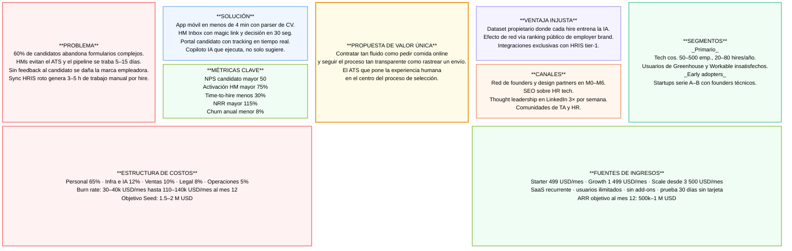
---

## 8. Casos de Uso Principales

### Caso de Uso 1 — El Candidato Aplica a una Vacante

**Actor principal:** Candidato externo
**Objetivo:** Completar una aplicación desde cualquier dispositivo en menos de 4 minutos, con total claridad sobre qué pasará a continuación.

**Flujo paso a paso:**

1. El candidato accede al career site de la empresa o a la vacante publicada en un job board.
2. Selecciona la posición y hace clic en "Aplicar". El sistema detecta si está en móvil o escritorio y adapta el formulario.
3. Puede importar su perfil desde LinkedIn o subir su CV. El parser extrae automáticamente nombre, experiencia, formación y habilidades, pre-rellenando los campos sin que el candidato deba escribir lo que ya está en su CV.
4. El formulario presenta solo los campos estrictamente necesarios para esa posición. No hay páginas de registro previo ni captchas. El progreso se guarda automáticamente si el candidato abandona y retoma.
5. Al enviar, el candidato recibe confirmación inmediata por email y WhatsApp con el nombre del recruiter responsable y un enlace a su portal personal de seguimiento.
6. Desde ese portal, el candidato puede ver en qué etapa está su candidatura, cuándo esperar novedades y cómo fue evaluado (una vez que el proceso avanza).

**Resultado esperado:** Tasa de finalización de aplicación >80% · Tiempo medio de aplicación <4 minutos · NPS del candidato >50

**Diagrama de flujo:**

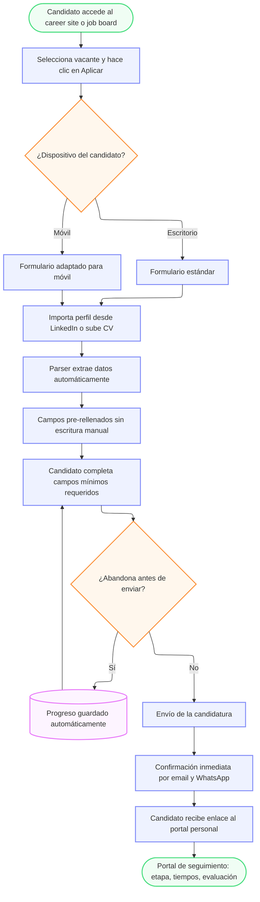

**Diagrama UML de caso de uso:**

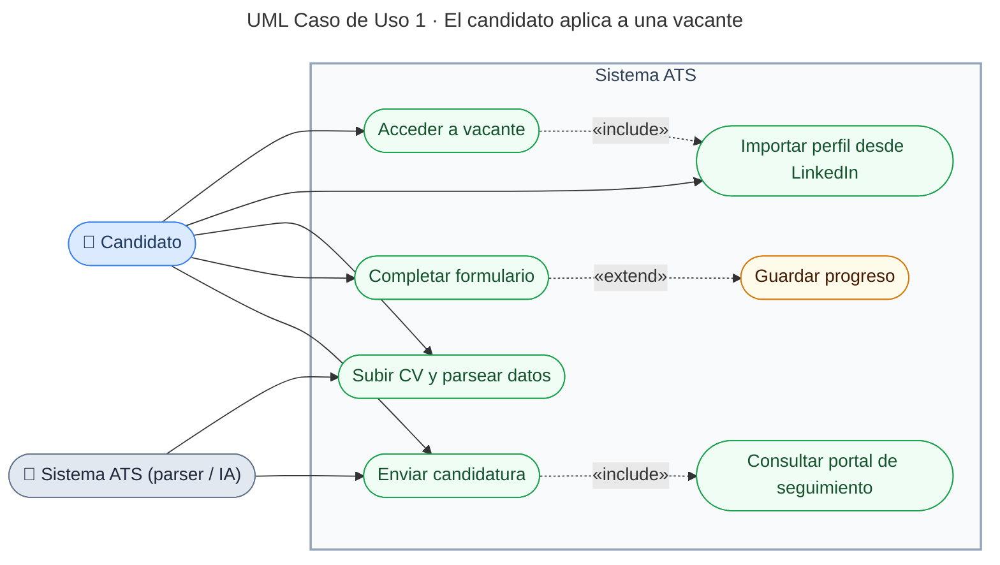

**Problema del mercado que resuelve:** El 60% de candidatos abandona aplicaciones complejas. El 69% abandona cuando el ATS falla al parsear su CV. Este caso de uso convierte la aplicación en una experiencia que el candidato quiere completar y recuerda positivamente.

---

### Caso de Uso 2 — El Hiring Manager Evalúa y Decide sobre un Candidato

**Actor principal:** Hiring Manager
**Objetivo:** Revisar un candidato y emitir una decisión en menos de 30 segundos desde el móvil, sin necesidad de acceder al sistema completo.

**Flujo paso a paso:**

1. El recruiter avanza un candidato a la etapa de revisión del hiring manager. El sistema genera automáticamente una notificación push y un email al HM.
2. El email contiene un magic link de acceso directo — sin usuario ni contraseña. El HM toca el enlace desde su teléfono.
3. Ve una tarjeta del candidato con: foto y nombre, resumen de 5 líneas generado por IA (experiencia relevante, puntos fuertes, posible fit con el rol), score de compatibilidad y el CV adjunto para quien quiera profundizar.
4. Debajo de la tarjeta, tres botones de acción: **Avanzar**, **Rechazar** y **Necesito más información** (que abre un campo de texto para dejar una nota al recruiter).
5. La decisión se registra en el sistema en tiempo real. El recruiter recibe la notificación de inmediato y puede actuar sobre el candidato sin esperar.
6. Si el HM no responde en 24 horas, el sistema envía un recordatorio automático. Si no responde en 48 horas, el recruiter recibe una alerta para hacer seguimiento.

**Resultado esperado:** Tasa de activación de HMs >75% · Tiempo de respuesta por candidato <24h · Reducción del time-to-hire en 5–15 días por vacante

**Diagrama de flujo:**

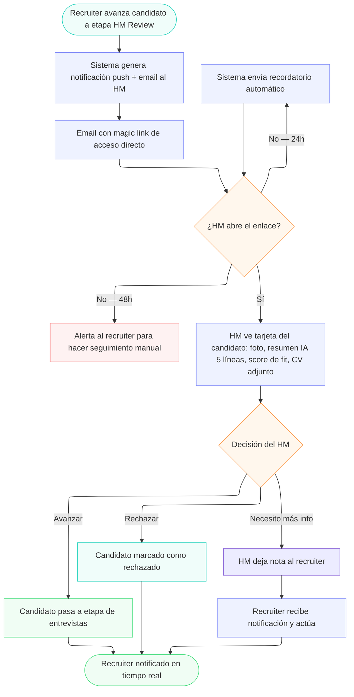

**Diagrama UML de caso de uso:**

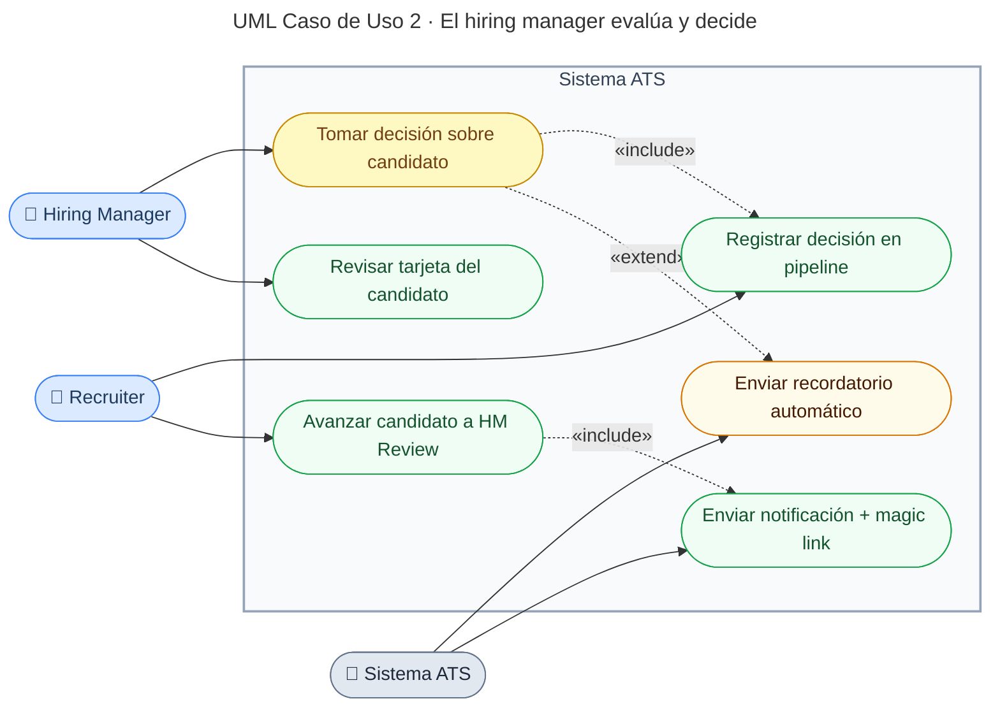

**Problema del mercado que resuelve:** Los hiring managers evitan entrar al ATS porque les resulta complejo. Su falta de feedback genera el cuello de botella más costoso del proceso de selección. Este caso de uso elimina la fricción por diseño: el HM nunca necesita aprender el sistema.

---

### Caso de Uso 3 — El Recruiter Coordina y Confirma una Entrevista

**Actor principal:** Recruiter
**Objetivo:** Agendar una entrevista entre el candidato y el entrevistador sin intercambio manual de emails, en menos de 2 minutos.

**Flujo paso a paso:**

1. El recruiter selecciona al candidato en el pipeline y hace clic en "Agendar entrevista". Elige el tipo (phone screen, técnica, panel) y los entrevistadores involucrados.
2. El sistema consulta automáticamente la disponibilidad real del calendario de los entrevistadores (Google Calendar u Outlook) y genera tres opciones de horario compatibles para los próximos 5 días hábiles.
3. El recruiter confirma las opciones con un clic. El sistema envía al candidato un email y un WhatsApp con los tres slots propuestos, con un enlace de confirmación en un solo toque.
4. El candidato elige su horario preferido. El sistema envía invitaciones de calendario automáticamente a todos los participantes, con el enlace de videollamada incluido si aplica.
5. 24 horas antes de la entrevista, el sistema envía recordatorios automáticos al candidato y a los entrevistadores. 1 hora antes, un recordatorio final al candidato.
6. Si el candidato necesita reprogramar, puede hacerlo desde el enlace del email sin contactar al recruiter. El sistema renegocia la disponibilidad y actualiza todos los calendarios.
7. Finalizada la entrevista, el sistema solicita automáticamente a cada entrevistador que complete su scorecard, con un recordatorio si no lo hace en 24 horas.

**Resultado esperado:** Tiempo de coordinación por entrevista reducido de 45–90 min a menos de 2 min · Tasa de no-shows reducida >40% · 100% de scorecards completados antes de la siguiente etapa

**Diagrama de flujo:**

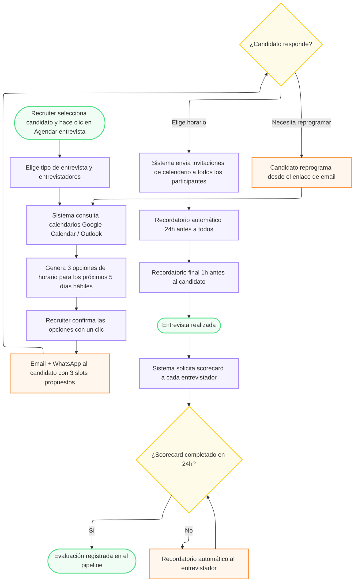

**Diagrama UML de caso de uso:**

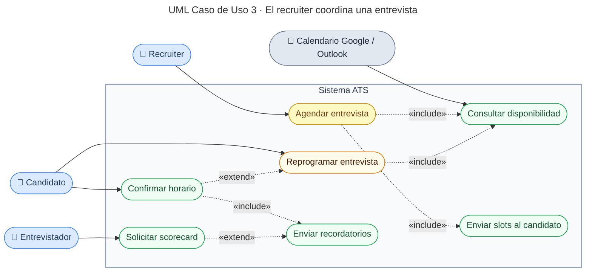

**Problema del mercado que resuelve:** La coordinación de entrevistas es la tarea más repetitiva y frustrante del recruiter, y una de las principales causas de burnout en equipos de TA. Este caso de uso la convierte en un proceso de un clic que el sistema ejecuta completamente de forma autónoma.

---

## 9. Modelo de Datos

El modelo de datos cubre las entidades, atributos y relaciones necesarias para soportar los tres casos de uso principales: aplicación del candidato, evaluación por el hiring manager y coordinación de entrevistas. El diseño prioriza simplicidad y extensibilidad.

### 9.1 Entidades y Atributos

#### `Organization` (Empresa cliente — raíz del tenant)

Entidad raíz del modelo multi-tenant. Cada empresa cliente que contrata el servicio es una `Organization`. Todas las demás entidades del sistema están vinculadas a ella mediante `organization_id`, lo que garantiza el aislamiento completo de datos entre tenants.

| Atributo | Tipo | Descripción |
|---|---|---|
| `id` | UUID | Identificador único de la organización |
| `name` | VARCHAR(200) | Nombre de la empresa |
| `slug` | VARCHAR(100) (único) | Identificador URL-safe (ej. `acme-corp`) |
| `plan` | ENUM | `starter` · `growth` · `scale` |
| `status` | ENUM | `active` · `suspended` · `cancelled` |
| `billing_email` | STRING | Email de contacto para facturación |
| `max_active_jobs` | INTEGER | Límite de vacantes activas según plan |
| `created_at` | TIMESTAMP | Fecha de alta |
| `updated_at` | TIMESTAMP | Última modificación |

---

#### `Job` (Vacante)

| Atributo | Tipo | Descripción |
|---|---|---|
| `id` | UUID | Identificador único de la vacante |
| `organization_id` | UUID (FK → Organization) | Tenant al que pertenece la vacante |
| `title` | STRING | Título del puesto |
| `description` | TEXT | Descripción completa del rol y responsabilidades |
| `requirements` | TEXT | Requisitos mínimos y deseables |
| `department` | STRING | Departamento o área de la empresa |
| `location` | STRING | Ubicación (ciudad, país o "remoto") |
| `employment_type` | ENUM | `full_time` · `part_time` · `contract` · `internship` |
| `salary_range_min` | INTEGER | Banda salarial mínima |
| `salary_range_max` | INTEGER | Banda salarial máxima |
| `status` | ENUM | `draft` · `published` · `paused` · `closed` |
| `published_at` | TIMESTAMP | Fecha y hora de publicación |
| `closes_at` | TIMESTAMP | Fecha límite de recepción (nullable) |
| `created_by` | UUID (FK → User) | Usuario que creó la vacante |
| `hiring_manager_id` | UUID (FK → User) | Hiring manager asignado |
| `created_at` | TIMESTAMP | Fecha de creación |
| `updated_at` | TIMESTAMP | Última modificación |

#### `Candidate` (Candidato)

| Atributo | Tipo | Descripción |
|---|---|---|
| `id` | UUID | Identificador único del candidato |
| `organization_id` | UUID (FK → Organization) | Tenant al que pertenece el candidato |
| `first_name` | STRING | Nombre |
| `last_name` | STRING | Apellido |
| `email` | STRING (único) | Email principal |
| `phone` | STRING | Teléfono con prefijo de país |
| `linkedin_url` | STRING | URL del perfil LinkedIn (nullable) |
| `location` | STRING | Ciudad y país |
| `cv_url` | STRING | Ruta al archivo CV (PDF) |
| `parsed_experience` | JSONB | Experiencia laboral extraída del CV |
| `parsed_education` | JSONB | Formación académica extraída del CV |
| `parsed_skills` | ARRAY[STRING] | Habilidades extraídas del CV |
| `source` | ENUM | `linkedin` · `indeed` · `career_site` · `referral` · `agency` · `other` |
| `gdpr_consent` | BOOLEAN | Consentimiento explícito de tratamiento de datos |
| `gdpr_consent_at` | TIMESTAMP | Fecha y hora del consentimiento |
| `portal_token` | STRING | Token único para acceso al portal de seguimiento (sin login). Ver nota de diseño. |
| `created_at` | TIMESTAMP | Fecha de registro |
| `updated_at` | TIMESTAMP | Última modificación |

> **Decisión de diseño — `portal_token` vs `MagicLink`:** El `portal_token` del candidato es un token de larga duración (no expira) que identifica al candidato en su portal de seguimiento de solo lectura. No concede acceso al sistema interno ni puede tomar acciones. Por ese motivo se modela como campo del `Candidate` en lugar de como entidad `MagicLink`: no tiene ciclo de vida de uso-único ni expiración. El `MagicLink` del HM Inbox, en cambio, es una sesión temporal de un solo uso con expiración de 72h que concede acceso de escritura (decisiones de avance/rechazo), lo que justifica su modelado como entidad separada con auditoría completa.

#### `Application` (Candidatura)

Entidad central del modelo. Representa la relación entre un candidato y una vacante específica, y contiene todo el estado del proceso de selección.

| Atributo | Tipo | Descripción |
|---|---|---|
| `id` | UUID | Identificador único |
| `organization_id` | UUID (FK → Organization) | Tenant al que pertenece la candidatura |
| `candidate_id` | UUID (FK → Candidate) | Candidato que aplica |
| `job_id` | UUID (FK → Job) | Vacante a la que aplica |
| `stage` | ENUM | `applied` · `screening` · `hm_review` · `interview` · `offer` · `hired` · `rejected` |
| `stage_updated_at` | TIMESTAMP | Cuándo cambió de etapa por última vez |
| `rejection_reason` | ENUM | `underqualified` · `overqualified` · `cultural_fit` · `position_cancelled` · `other` (nullable) |
| `rejection_note` | TEXT | Nota interna sobre el rechazo (no visible al candidato) |
| `ai_fit_score` | FLOAT | Score 0–1 de compatibilidad calculado por IA |
| `ai_summary` | TEXT | Resumen de 5 líneas generado por IA para el HM Inbox |
| `cover_letter` | TEXT | Carta de presentación (nullable) |
| `answers` | JSONB | Respuestas a preguntas de knockout |
| `candidate_nps` | INTEGER | Puntuación NPS del candidato (0–10, nullable) |
| `candidate_nps_comment` | TEXT | Comentario libre del candidato (nullable) |
| `assigned_recruiter_id` | UUID (FK → User) | Recruiter responsable |
| `created_at` | TIMESTAMP | Fecha de aplicación |
| `updated_at` | TIMESTAMP | Última modificación |

#### `User` (Usuario interno)

| Atributo | Tipo | Descripción |
|---|---|---|
| `id` | UUID | Identificador único |
| `organization_id` | UUID (FK → Organization) | Tenant al que pertenece el usuario |
| `first_name` | STRING | Nombre |
| `last_name` | STRING | Apellido |
| `email` | STRING (único) | Email corporativo |
| `role` | ENUM | `admin` · `recruiter` · `hiring_manager` · `ta_lead` · `viewer` |
| `department` | STRING | Departamento |
| `calendar_provider` | ENUM | `google` · `outlook` · `none` |
| `calendar_token` | TEXT | Token OAuth para calendario (encriptado, nullable) |
| `notification_email` | BOOLEAN | Recibe notificaciones por email |
| `notification_push` | BOOLEAN | Recibe notificaciones push móvil |
| `is_active` | BOOLEAN | Si el usuario tiene acceso activo |
| `last_login_at` | TIMESTAMP | Fecha y hora del último acceso (nullable) |
| `created_at` | TIMESTAMP | Fecha de creación |
| `updated_at` | TIMESTAMP | Última modificación |

> **Nota:** Los magic links de acceso al HM Inbox se gestionan en la entidad `MagicLink` (ver más abajo), no como campos del usuario, ya que conceptualmente son sesiones temporales con ciclo de vida propio.

#### `Interview` (Entrevista)

| Atributo | Tipo | Descripción |
|---|---|---|
| `id` | UUID | Identificador único |
| `organization_id` | UUID (FK → Organization) | Tenant al que pertenece la entrevista |
| `application_id` | UUID (FK → Application) | Candidatura a la que pertenece |
| `type` | ENUM | `phone_screen` · `technical` · `panel` · `cultural_fit` · `final` |
| `status` | ENUM | `proposed` · `scheduled` · `confirmed` · `completed` · `cancelled` · `no_show` |
| `scheduled_at` | TIMESTAMP | Fecha y hora definitiva (nullable hasta confirmar) |
| `duration_minutes` | INTEGER | Duración prevista en minutos |
| `location_type` | ENUM | `video` · `phone` · `in_person` |
| `video_link` | STRING | URL de la videollamada (nullable) |
| `reminder_sent_24h` | BOOLEAN | Si se envió el recordatorio de 24h |
| `reminder_sent_1h` | BOOLEAN | Si se envió el recordatorio de 1h |
| `created_by` | UUID (FK → User) | Usuario que creó la entrevista |
| `created_at` | TIMESTAMP | Fecha de creación |
| `updated_at` | TIMESTAMP | Última modificación |

#### `InterviewParticipant` (Participante de entrevista)

Tabla de unión entre `Interview` y `User` que registra a cada entrevistador y su estado de confirmación y evaluación.

| Atributo | Tipo | Descripción |
|---|---|---|
| `id` | UUID | Identificador único |
| `interview_id` | UUID (FK → Interview) | Entrevista a la que pertenece |
| `user_id` | UUID (FK → User) | Entrevistador asignado |
| `confirmed` | BOOLEAN | Si el entrevistador confirmó asistencia |
| `confirmed_at` | TIMESTAMP | Cuándo confirmó (nullable) |
| `calendar_event_id` | STRING | ID del evento en calendario (nullable) |
| `scorecard_submitted` | BOOLEAN | Si completó y envió su scorecard |
| `scorecard_submitted_at` | TIMESTAMP | Cuándo lo envió (nullable) |
| `created_at` | TIMESTAMP | Fecha de creación |

#### `Scorecard` (Evaluación de entrevista)

| Atributo | Tipo | Descripción |
|---|---|---|
| `id` | UUID | Identificador único |
| `interview_participant_id` | UUID (FK → InterviewParticipant) | Evaluador y entrevista correspondientes |
| `application_id` | UUID (FK → Application) | Candidatura evaluada |
| `overall_rating` | ENUM | `strong_yes` · `yes` · `neutral` · `no` · `strong_no` |
| `criteria_scores` | JSONB | Puntuaciones por criterio (ej. `{"technical": 4, "communication": 3}`) |
| `strengths` | TEXT | Puntos fuertes observados |
| `concerns` | TEXT | Dudas o puntos débiles observados |
| `notes` | TEXT | Notas libres adicionales |
| `submitted_at` | TIMESTAMP | Fecha y hora de envío |
| `created_at` | TIMESTAMP | Fecha de creación |

#### `Notification` (Notificación)

| Atributo | Tipo | Descripción |
|---|---|---|
| `id` | UUID | Identificador único |
| `organization_id` | UUID (FK → Organization) | Tenant al que pertenece la notificación |
| `recipient_type` | ENUM | `candidate` · `user` |
| `recipient_id` | UUID | ID del candidato o usuario destinatario |
| `channel` | ENUM | `email` · `whatsapp` · `push` · `sms` |
| `type` | ENUM | `application_received` · `stage_change` · `interview_scheduled` · `interview_reminder` · `scorecard_request` · `hm_inbox_alert` · `rejection` · `offer` |
| `status` | ENUM | `pending` · `sent` · `delivered` · `failed` |
| `sent_at` | TIMESTAMP | Cuándo fue enviada (nullable) |
| `payload` | JSONB | Contenido y variables de la notificación |
| `related_entity_type` | STRING | Entidad relacionada: `application`, `interview`, etc. |
| `related_entity_id` | UUID | ID de la entidad relacionada |
| `created_at` | TIMESTAMP | Fecha de creación |

#### `MagicLink` (Sesión temporal para HM Inbox)

Entidad que gestiona los tokens de acceso sin login para el flujo del HM Inbox. Se modela como entidad separada de `User` porque tiene ciclo de vida propio: se crea, se consume y se invalida de forma independiente al perfil del usuario.

| Atributo | Tipo | Descripción |
|---|---|---|
| `id` | UUID | Identificador único |
| `organization_id` | UUID (FK → Organization) | Tenant al que pertenece |
| `user_id` | UUID (FK → User) | Hiring manager destinatario |
| `application_id` | UUID (FK → Application) | Candidatura a revisar |
| `token` | STRING (único) | Token criptográficamente aleatorio (256 bits) |
| `expires_at` | TIMESTAMP | Expiración (72h desde creación) |
| `used_at` | TIMESTAMP | Cuándo fue consumido (NULL si no usado) |
| `created_at` | TIMESTAMP | Fecha de creación |

**Flujo de validación:** Al procesar el token, el sistema verifica en orden: (1) `token` existe en la tabla, (2) `expires_at > NOW()`, (3) `used_at IS NULL`. Si las tres condiciones se cumplen, concede acceso y actualiza `used_at` en la misma transacción. Cualquier fallo rechaza la solicitud sin información adicional.

#### `AuditLog` (Registro de auditoría)

Entidad inmutable que registra toda acción relevante sobre datos del sistema: cambios de estado, decisiones de contratación, accesos por magic link, modificaciones de configuración y operaciones GDPR. Garantiza trazabilidad completa para cumplimiento normativo y depuración.

| Atributo | Tipo | Descripción |
|---|---|---|
| `id` | UUID | Identificador único |
| `organization_id` | UUID (FK → Organization) | Tenant donde ocurrió el evento |
| `user_id` | UUID (FK → User, nullable) | Usuario que realizó la acción (NULL para acciones de sistema) |
| `entity_type` | VARCHAR | Entidad afectada: `application`, `job`, `candidate`, `interview`, etc. |
| `entity_id` | UUID | ID del registro afectado |
| `action` | VARCHAR | Acción realizada: `create`, `update`, `delete`, `stage_change`, `access`, etc. |
| `old_values` | JSONB | Estado anterior del registro (nullable en creaciones) |
| `new_values` | JSONB | Estado posterior del registro (nullable en eliminaciones) |
| `ip_address` | INET | Dirección IP del solicitante |
| `user_agent` | TEXT | Agente de usuario del cliente (nullable) |
| `created_at` | TIMESTAMP | Marca temporal del evento (inmutable) |

> **Nota de implementación:** La tabla `AuditLog` es de solo inserción (append-only). Ningún proceso tiene permisos de `UPDATE` o `DELETE` sobre ella. La retención es de 5 años para cumplimiento con normativas laborales y GDPR.

### 9.2 Relaciones entre Entidades

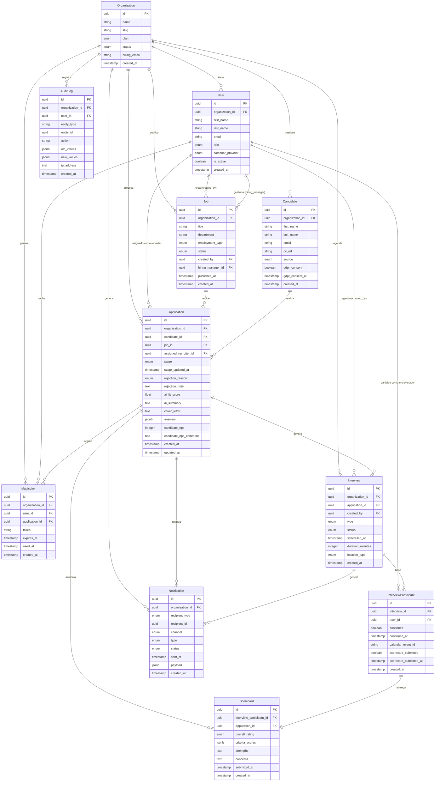

### 9.3 Relaciones Principales

| Relación | Cardinalidad | Descripción |
|---|---|---|
| `Organization` → `User` | 1:N | Una organización tiene múltiples usuarios internos |
| `Organization` → `Job` | 1:N | Una organización publica múltiples vacantes |
| `Organization` → `Candidate` | 1:N | Una organización gestiona su propio pool de candidatos |
| `Organization` → `Application` | 1:N | Todas las candidaturas pertenecen a un tenant |
| `Organization` → `AuditLog` | 1:N | Registro completo de eventos por tenant |
| `Organization` → `Notification` | 1:N | Todas las notificaciones pertenecen a un tenant |
| `User` → `Job` (hiring_manager) | 1:N | Un hiring manager puede tener múltiples vacantes asignadas |
| `Job` → `Application` | 1:N | Una vacante recibe múltiples candidaturas |
| `Candidate` → `Application` | 1:N | Un candidato puede aplicar a múltiples vacantes de la misma organización |
| `Application` → `Interview` | 1:N | Una candidatura puede tener múltiples entrevistas |
| `Application` → `MagicLink` | 1:N | Cada alerta HM genera un MagicLink nuevo |
| `Interview` → `InterviewParticipant` | 1:N | Una entrevista puede tener múltiples entrevistadores |
| `InterviewParticipant` → `Scorecard` | 1:1 | Cada participante entrega un único scorecard por entrevista |
| `Application` → `Scorecard` | 1:N | Una candidatura acumula scorecards de cada entrevistador en cada ronda |

### 9.4 Reglas de Integridad y Negocio

#### Constraints de base de datos

```sql
-- RN-01: Un candidato no puede aplicar más de una vez a la misma vacante
ALTER TABLE applications ADD CONSTRAINT uq_candidate_job UNIQUE (candidate_id, job_id);

-- RN-02: El token de magic link es único en la tabla
ALTER TABLE magic_links ADD CONSTRAINT uq_magic_link_token UNIQUE (token);

-- RN-03: El email de candidato es único por organización
ALTER TABLE candidates ADD CONSTRAINT uq_candidate_email_org UNIQUE (organization_id, email);

-- RN-04: El email de usuario interno es único globalmente (un user no puede pertenecer a dos orgs)
ALTER TABLE users ADD CONSTRAINT uq_user_email UNIQUE (email);

-- RN-05: El slug de organización es único globalmente
ALTER TABLE organizations ADD CONSTRAINT uq_organization_slug UNIQUE (slug);
```

#### Reglas de negocio verificables

| ID | Regla | Entidad/es afectada/s | Validable |
|---|---|---|---|
| **RN-01** | Un candidato solo puede tener una `Application` activa por vacante | `Application` | `UNIQUE(candidate_id, job_id)` en DB |
| **RN-02** | Un `MagicLink` solo puede usarse una vez: `used_at IS NULL` al validar | `MagicLink` | Query: `SELECT used_at FROM magic_links WHERE token = ?` |
| **RN-03** | Toda entidad operacional debe tener `organization_id` — sin excepciones | Todas las tenant-scoped | RLS Policy en PostgreSQL |
| **RN-04** | No se puede crear una `Interview` para una `Application` en estado `rejected` o `hired` | `Interview`, `Application` | Check en capa de servicio antes de INSERT |
| **RN-05** | No se puede avanzar de `interview` a `offer` con scorecards pendientes | `Application`, `InterviewParticipant` | `scorecard_submitted = true` para todos los participantes de la última ronda |
| **RN-06** | No se puede crear una `Application` sin `gdpr_consent = true` en el `Candidate` | `Application`, `Candidate` | Validación en endpoint de aplicación |
| **RN-07** | Toda decisión de contratación (`hired`) debe estar registrada en `AuditLog` | `AuditLog`, `Application` | Trigger en base de datos al hacer `stage = hired` |

**Expiración del magic link:** Cada nueva alerta al HM invalida el `MagicLink` anterior para esa candidatura creando uno nuevo. El token expira en 72h independientemente de si fue usado.

**Consentimiento GDPR:** Los registros de candidatos sin candidaturas activas se eliminan automáticamente a los 12 meses. El evento de borrado queda registrado en `AuditLog`.

### 9.5 Schemas de campos JSONB

Los campos JSONB tienen estructura interna fija. Todo código que lea o escriba estos campos debe validar contra estos schemas.

#### `Application.answers`

Respuestas a las preguntas de knockout definidas por la vacante. Cada pregunta tiene un ID que se referencia desde la definición del `Job`.

```json
{
  "questions": [
    {
      "question_id": "uuid",
      "question_text": "¿Tienes 3+ años de experiencia en React?",
      "answer_type": "boolean | text | number | single_choice",
      "answer_value": true
    }
  ]
}
```

Una respuesta de tipo `boolean` con `answer_value: false` en una pregunta marcada como knockout desencadena rechazo automático del sistema (el único rechazo automático permitido por AI Governance — es una regla de negocio determinista, no IA).

#### `Scorecard.criteria_scores`

Puntuaciones por criterio de evaluación. Los criterios se definen a nivel de `Job` (no documentado en este MVP — extensión futura). Para el MVP, el conjunto de criterios es fijo.

```json
{
  "technical_skills": { "score": 4, "max": 5 },
  "communication": { "score": 3, "max": 5 },
  "culture_fit": { "score": 5, "max": 5 },
  "problem_solving": { "score": 4, "max": 5 },
  "leadership": { "score": 3, "max": 5 }
}
```

Rango de `score`: 1–5 entero. Todos los criterios son obligatorios antes de marcar `scorecard_submitted = true`.

#### `Notification.payload`

Variables de renderizado de la plantilla. El `template_type` determina qué variables son obligatorias.

```json
{
  "template_type": "interview_scheduled",
  "recipient_name": "Ana García",
  "job_title": "Senior Frontend Engineer",
  "interview_date": "2026-06-15",
  "interview_time": "10:00",
  "interview_timezone": "America/Argentina/Buenos_Aires",
  "interview_type": "video",
  "video_link": "https://meet.google.com/abc-def-ghi",
  "confirm_url": "https://ats.com/confirm?token=...",
  "reschedule_url": "https://ats.com/reschedule?token=..."
}
```

#### `AuditLog.old_values` / `AuditLog.new_values`

Snapshot del registro afectado en el momento del evento. Para `stage_change`:

```json
{
  "stage": "hm_review",
  "stage_updated_at": "2026-06-10T14:32:00Z",
  "ai_fit_score": 0.87,
  "ai_summary": "Candidato con 5 años en React..."
}
```

Solo se almacenan los campos que cambiaron, no el registro completo, excepto en acciones `create` y `delete` donde se almacena el registro íntegro.

### 9.6 Implementación RLS e Índices de base de datos

#### Row-Level Security (PostgreSQL)

Cada tabla tenant-scoped tiene una política RLS que filtra por `organization_id`. El middleware inyecta el valor al inicio de cada transacción.

```sql
-- Activar RLS en todas las tablas tenant-scoped
ALTER TABLE jobs ENABLE ROW LEVEL SECURITY;
ALTER TABLE candidates ENABLE ROW LEVEL SECURITY;
ALTER TABLE applications ENABLE ROW LEVEL SECURITY;
ALTER TABLE interviews ENABLE ROW LEVEL SECURITY;
ALTER TABLE interview_participants ENABLE ROW LEVEL SECURITY;
ALTER TABLE scorecards ENABLE ROW LEVEL SECURITY;
ALTER TABLE notifications ENABLE ROW LEVEL SECURITY;
ALTER TABLE magic_links ENABLE ROW LEVEL SECURITY;
ALTER TABLE audit_logs ENABLE ROW LEVEL SECURITY;

-- Política genérica (replicar por tabla)
CREATE POLICY tenant_isolation ON applications
  USING (organization_id = current_setting('app.organization_id')::uuid);

-- El middleware ejecuta esto al inicio de cada request autenticado:
-- SET LOCAL app.organization_id = '<uuid-del-tenant>';
```

`AuditLog` tiene RLS pero no permite DELETE ni UPDATE mediante política de rol:

```sql
-- Rol de aplicación: sin permisos de modificación en audit_logs
REVOKE UPDATE, DELETE ON audit_logs FROM app_role;
```

#### Índices recomendados

```sql
-- Queries de pipeline más frecuentes
CREATE INDEX idx_applications_org_job ON applications (organization_id, job_id);
CREATE INDEX idx_applications_org_stage ON applications (organization_id, stage);
CREATE INDEX idx_applications_org_recruiter ON applications (organization_id, assigned_recruiter_id);

-- Validación de magic link (query crítica de baja latencia)
CREATE UNIQUE INDEX idx_magic_links_token ON magic_links (token);
CREATE INDEX idx_magic_links_user_app ON magic_links (user_id, application_id);

-- Portal del candidato
CREATE INDEX idx_candidates_portal_token ON candidates (portal_token);

-- Auditoría y compliance
CREATE INDEX idx_audit_logs_entity ON audit_logs (organization_id, entity_type, entity_id);
CREATE INDEX idx_audit_logs_user ON audit_logs (organization_id, user_id, created_at DESC);

-- Notificaciones y deduplicación
CREATE INDEX idx_notifications_recipient ON notifications (organization_id, recipient_type, recipient_id, created_at DESC);
CREATE INDEX idx_notifications_entity ON notifications (related_entity_type, related_entity_id, type);
```

#### `NotificationTemplateType` — Definición de tipos

El tipo referenciado en el código del worker (sección 13, Nivel 4) se define así:

```typescript
type NotificationTemplateType =
  | 'application_received'      // → Candidato: confirmación de recepción
  | 'stage_change'              // → Candidato: cambio de etapa genérico
  | 'hm_inbox_alert'            // → HM: nuevo candidato para revisar (con magic link)
  | 'hm_reminder_24h'           // → HM: recordatorio si no respondió en 24h
  | 'interview_scheduled'       // → Candidato + entrevistadores: entrevista confirmada
  | 'interview_reminder_24h'    // → Candidato + entrevistadores: recordatorio 24h antes
  | 'interview_reminder_1h'     // → Candidato: recordatorio 1h antes
  | 'scorecard_request'         // → Entrevistador: solicitud de completar scorecard
  | 'rejection'                 // → Candidato: rechazo (tono empático, sin motivo detallado)
  | 'offer'                     // → Candidato: notificación de oferta formal

// Cada template existe en sus variantes de canal:
// application_received.email.html
// application_received.whatsapp.txt
// etc.
```

Las plantillas se almacenan en el filesystem del backend bajo `/templates/<template_type>/<channel>.<format>`. En plan Growth y Scale, las organizaciones pueden personalizar el contenido desde la UI de configuración.

---

#### Máquina de estados — `Application.stage`

El campo `stage` sigue una máquina de estados con transiciones explícitas. El módulo `pipeline` valida en capa de servicio que toda transición sea válida antes de hacer el UPDATE. Transiciones no listadas son rechazadas con error `422 Unprocessable Entity`.

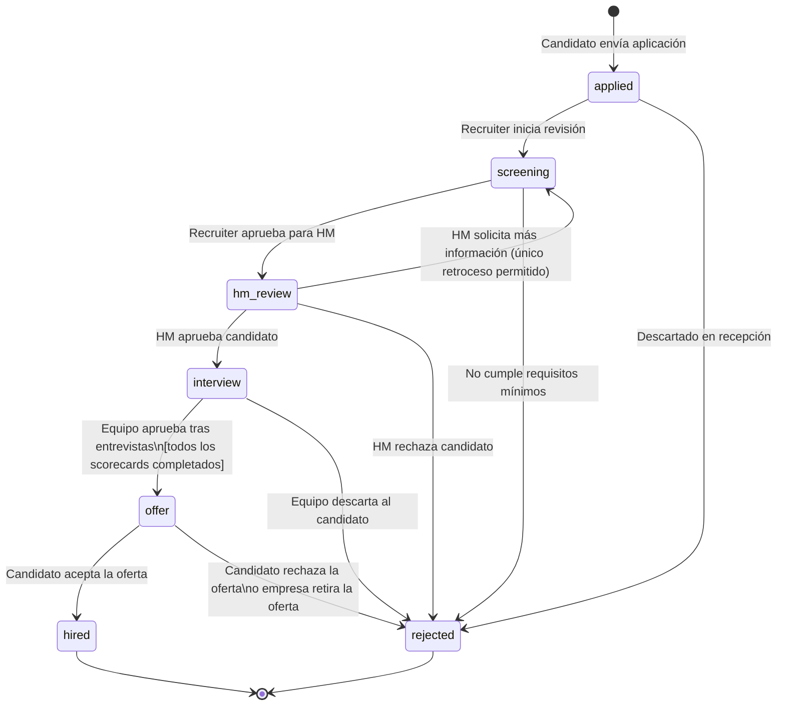

> **Nota para implementación:** El único retroceso permitido es `hm_review → screening`. Todas las demás transiciones son hacia adelante o hacia `rejected`. Un candidato en estado `hired` o `rejected` no puede ser movido a ningún otro estado (terminal). La transición `interview → offer` tiene una guarda: `RN-05` debe cumplirse (todos los `InterviewParticipant` de la última ronda con `scorecard_submitted = true`).

---

## 10. Stack Tecnológico

Referencia única del stack para el MVP. Toda decisión de implementación debe alinearse con estas elecciones antes de proponer alternativas.

| Capa | Tecnología | Versión mínima | Alternativa descartada | Razón |
|---|---|---|---|---|
| **Lenguaje backend** | TypeScript | 5.x | Python | Tipado estático en todo el stack; el frontend ya usa TS |
| **Runtime** | Node.js | 22 LTS | Deno, Bun | Ecosistema maduro; compatibilidad con BullMQ y librerías HRIS |
| **Framework HTTP** | Fastify | 4.x | Express, NestJS | Rendimiento; soporte nativo de JSON Schema; menor overhead que NestJS para MVP |
| **ORM** | Drizzle ORM | latest | Prisma, TypeORM | Queries cercanas a SQL, sin magic; tipado end-to-end sin codegen externo |
| **Base de datos principal** | PostgreSQL | 16+ | MySQL | JSONB nativo, RLS, `erDiagram` expressions, soporte INET para AuditLog |
| **Cache / Cola** | Redis + BullMQ | Redis 7+ | RabbitMQ, SQS | BullMQ sobre Redis unifica cache y cola en una sola dependencia de infraestructura |
| **Almacenamiento archivos** | Cloudflare R2 | — | AWS S3 | S3-compatible sin egress fees; compatible con SDK de S3 |
| **Frontend** | React + Vite | React 19, Vite 5 | Next.js | Menor complejidad de despliegue para MVP; SSR no requerido en fase 1 |
| **Email** | Resend | — | SendGrid | API moderna, SDK TS nativo, mejor DX; SendGrid como fallback |
| **WhatsApp** | 360dialog | — | Twilio | Menor costo por mensaje en LATAM; acceso directo a API de Meta |
| **Push notifications** | Firebase FCM | — | OneSignal | Gratuito hasta 1M mensajes/día; SDK bien mantenido |
| **Calendario** | Google Calendar API + Microsoft Graph | — | CalDAV genérico | Los dos providers cubren el 95% del mercado objetivo |
| **LLM externo** | OpenAI GPT-4o mini | — | Claude Haiku, Gemini Flash | Menor costo por token para parsing y scoring; fácil swap via abstracción |
| **CI/CD** | GitHub Actions | — | GitLab CI | Integrado con el repositorio; runners gratuitos suficientes para MVP |
| **Hosting (MVP)** | Railway | — | Render, Fly.io | Deploy PostgreSQL + Redis + backend en un solo proveedor; créditos para startups |
| **Hosting (escala)** | AWS ECS + RDS | — | GCP, Azure | Trigger: 500+ clientes activos o necesidad de SLA enterprise |
| **Monitoreo** | Sentry (errores) + Datadog (métricas) | — | New Relic | Sentry gratuito para MVP; Datadog activado en escala |

> **Convención de nombres de tablas:** snake_case plural en PostgreSQL (`applications`, `magic_links`, `audit_logs`, `interview_participants`). Los nombres de entidades en el modelo de datos usan PascalCase singular — la correspondencia es directa con el sufijo `s` o `_s`.

---

## 11. Diseño del Sistema a Alto Nivel

El sistema sigue una arquitectura de **monolito modular** en la fase de diseño preliminar, con separación clara entre módulos para facilitar la extracción a microservicios cuando el crecimiento lo justifique. Esta decisión evita la complejidad operacional prematura de los microservicios manteniendo velocidad de desarrollo sin sacrificar la separación de responsabilidades.

```
┌─────────────────────────────────────────────────────────────────┐
│                         CLIENTES                                │
├──────────────┬──────────────────┬───────────────────────────────┤
│  Web App     │   Mobile Web     │   HM Inbox (magic link)       │
│  (React SPA) │   (PWA)          │   (email → token URL)         │
├──────────────┴──────────────────┴───────────────────────────────┤
│                        CDN / Edge                               │
│              (assets estáticos, cache de respuestas)            │
├─────────────────────────────────────────────────────────────────┤
│                      API GATEWAY                                │
│   Rate limiting · Autenticación JWT · Routing · Logging         │
├────────────┬────────────┬────────────┬────────────┬─────────────┤
│  Auth      │  Jobs      │  Pipeline  │ Interviews │ Notif.      │
│  Module    │  Module    │  Module    │  Module    │  Module     │
├────────────┴────────────┴────────────┴────────────┴─────────────┤
│                     SERVICIOS TRANSVERSALES                     │
│   AI Service · CV Parser · Calendar Sync · File Storage         │
├─────────────────────────────────────────────────────────────────┤
│                        CAPA DE DATOS                            │
│   PostgreSQL (principal) · Redis (cache/jobs) · S3 (archivos)   │
├─────────────────────────────────────────────────────────────────┤
│                   INFRAESTRUCTURA / CLOUD                       │
│   AWS / Railway · CI/CD · Monitoring · Alerting                 │
└─────────────────────────────────────────────────────────────────┘
```

**Diagrama de arquitectura:**

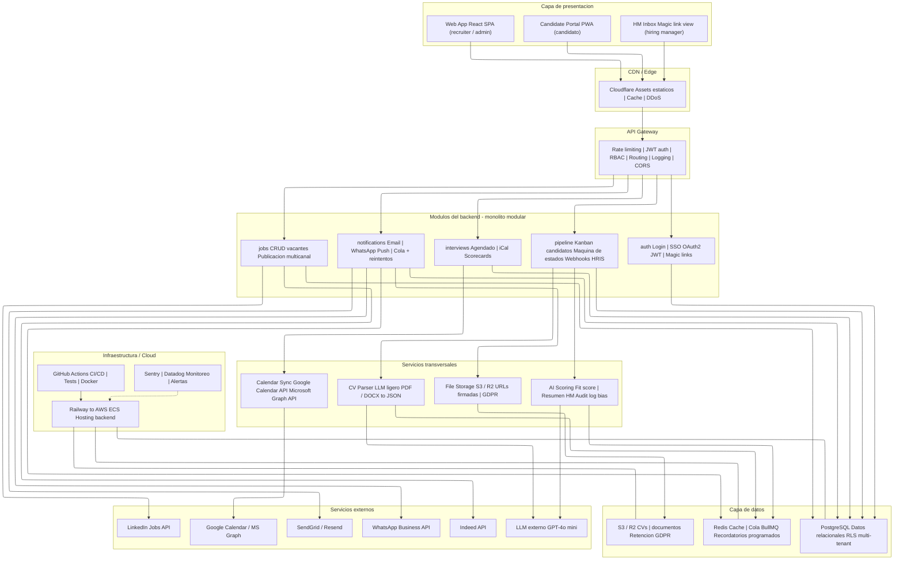

El sistema se organiza en siete capas con responsabilidades claramente delimitadas. Los tres clientes — la Web App para recruiters, el Candidate Portal para candidatos y el HM Inbox para hiring managers — acceden al sistema a través de Cloudflare, que actúa como CDN y primera línea de protección. Todo el tráfico entra por un único API Gateway que centraliza autenticación JWT, control de acceso por rol (RBAC), rate limiting y logging estructurado.

El backend es un **monolito modular** compuesto por cinco módulos independientes: `auth` gestiona identidad y magic links; `jobs` controla el ciclo de vida de vacantes y su distribución a job boards externos; `pipeline` es el núcleo transaccional que mueve candidatos entre etapas con validación de reglas de negocio; `interviews` orquesta el agendado con integración de calendarios; y `notifications` opera el motor multicanal de comunicaciones con cola de reintentos.

Los cuatro **servicios transversales** son consumidos por múltiples módulos: el CV Parser extrae datos estructurados de documentos vía LLM; el AI Scoring calcula el fit del candidato y genera el resumen para el HM Inbox; el Calendar Sync abstrae las diferencias entre Google Calendar y Microsoft Graph; y el File Storage gestiona el ciclo de vida de archivos con URLs firmadas y purga GDPR.

La **capa de datos** combina PostgreSQL como base relacional principal con Row-Level Security para aislamiento multi-tenant, Redis para cache de consultas frecuentes y cola de trabajos asíncronos (BullMQ), y S3/R2 para almacenamiento de archivos. El despliegue arranca en Railway para el MVP y migra a AWS ECS al superar los 500 clientes, con GitHub Actions como pipeline de CI/CD y Sentry + Datadog para observabilidad en producción.

**Decisiones de seguridad clave:**

| Capa | Medida implementada |
|---|---|
| Transporte | HTTPS obligatorio en todos los endpoints. HSTS activado. |
| Autenticación | JWT con access tokens de 1h. Refresh tokens de 30 días. Magic links de un solo uso con expiración de 72h |
| Autorización | RBAC estricto por endpoint. Un recruiter solo puede operar candidaturas de sus vacantes asignadas |
| Datos en reposo | Encriptación AES-256 en la base de datos. Tokens OAuth encriptados a nivel de columna |
| Multi-tenancy | Row-Level Security en PostgreSQL. `organization_id` inyectado automáticamente por middleware en cada query |
| GDPR | Endpoint de borrado de datos de candidato. Purga automática programada a los 12 meses. Registro en `AuditLog` |

### 11.1 Modelo de Seguridad y Autenticación

El sistema implementa un stack de identidad en capas que cubre los tres tipos de acceso: usuarios internos con sesión completa, hiring managers con acceso puntual por magic link, y candidatos con token de portal.

**Autenticación de usuarios internos:**
- **SSO SAML 2.0 / OIDC** — Integración con proveedores corporativos (Okta, Azure AD, Google Workspace). Los planes Growth y Scale pueden exigir SSO como único método de acceso.
- **OAuth 2.0** — Flujo estándar para usuarios sin SSO corporativo.
- **MFA opcional** — TOTP (Google Authenticator, Authy) disponible para todos los roles. Obligatorio para `admin` en plan Scale.
- **JWT con rotación** — Access token de 1h + refresh token de 30 días. Revocación inmediata al desactivar usuario.

**Autorización — RBAC:**

| Rol | Permisos principales |
|---|---|
| `admin` | Configuración completa del tenant, gestión de usuarios, integraciones |
| `ta_lead` | Todo lo de recruiter + analytics globales + gestión de vacantes propias y del equipo |
| `recruiter` | CRUD de vacantes y candidaturas asignadas, coordinación de entrevistas |
| `hiring_manager` | Lectura de candidaturas de sus vacantes, emisión de decisiones vía HM Inbox |
| `viewer` | Solo lectura de pipeline. Sin acceso a datos personales de candidatos |

El middleware aplica `organization_id` en cada request autenticado, garantizando que ningún usuario pueda operar fuera de su tenant aunque manipule parámetros de la URL.

**Autenticación HM Inbox (magic link):**
El flujo está documentado en la entidad `MagicLink` (sección 9.1). El token es de 256 bits, de un solo uso y expira en 72h. No otorga acceso a otras secciones del sistema.

### 11.2 AI Governance

La plataforma utiliza IA generativa y modelos de scoring en el flujo de evaluación de candidatos. Dado el impacto que estas decisiones tienen sobre personas, se establecen principios de gobernanza explícitos:

**Human-in-the-loop obligatorio**
La IA no toma decisiones de contratación. Toda acción que modifica el `stage` de una `Application` requiere confirmación explícita de un usuario humano. El sistema puede sugerir (`ai_fit_score`, `ai_summary`), pero nunca ejecutar automáticamente un avance o rechazo.

**Explainability**
El `ai_summary` que ve el hiring manager incluye las razones que generaron el score de fit: qué experiencias coinciden con los requisitos, qué gaps se detectaron. No se exponen probabilidades brutas sin contexto.

**Auditoría de decisiones con IA**
Toda candidatura con `ai_fit_score` que luego recibe una decisión de contratación queda registrada en `AuditLog` con los valores de IA en el momento de la decisión (`old_values`). Esto permite revisar si el score IA correlaciona con las decisiones reales y detectar patrones de sesgo.

**Sesgo y fairness**
El modelo de scoring se entrena excluyendo atributos protegidos (nombre, género inferido, nacionalidad, edad estimada). El equipo de producto revisa métricas de equidad (disparate impact) en cada release del modelo. Los clientes en plan Scale pueden solicitar un informe de fairness semestral.

### 11.3 Justificación — Monolito Modular

La decisión de adoptar una arquitectura de **monolito modular** para el backend responde a un balance deliberado entre velocidad de desarrollo, madurez del equipo, complejidad operacional y horizonte de crecimiento. Esta arquitectura permite construir un producto sólido, mantenible y con separación clara de responsabilidades desde el día 1, sin incurrir en la sobrecarga operacional que impondrían los microservicios en una fase de producto tan temprana.

- **Evitar complejidad operacional prematura** — Los microservicios requieren service mesh, distributed tracing y orquestación que no se justifican antes de los 500 clientes.
- **Velocidad de desarrollo como ventaja competitiva** — Un monolito modular permite iterar en días, no semanas.
- **Separación de responsabilidades sin sobrecarga de red** — Los módulos se comunican in-process; las llamadas inter-módulo son llamadas de función, no HTTP.
- **Compatibilidad con la capa de datos elegida** — PostgreSQL con transacciones ACID entre módulos es imposible en microservicios sin sagas; en el monolito es nativo.
- **El módulo de Notificaciones como caso de validación** — Ya opera de forma asíncrona (BullMQ) sin acoplar el resto del sistema, validando el patrón de desacoplamiento sin necesidad de un servicio separado.

Los módulos están diseñados con fronteras claras para que, cuando el negocio lo requiera, puedan extraerse como microservicios sin necesidad de reescribir el dominio de negocio. El trigger recomendado para esa extracción es superar los 500 clientes activos o identificar un módulo con patrones de carga radicalmente distintos al resto.

---

## 12. Contrato de API — Endpoints Principales

Todos los endpoints usan prefijo `/api/v1`. Autenticación por header `Authorization: Bearer <jwt>` excepto los endpoints públicos marcados con 🔓. El `organization_id` nunca viaja en el body: el middleware lo extrae del JWT y lo inyecta en cada query.

**Convenciones de respuesta:**
- Éxito: `{ data: <payload>, meta?: { page, total } }`
- Error: `{ error: { code: string, message: string, details?: object } }`
- Códigos de error de negocio: `422` para violaciones de reglas de negocio (con `code` descriptivo como `"DUPLICATE_APPLICATION"`, `"INVALID_STAGE_TRANSITION"`).

### Módulo Auth

| Método | Path | Descripción | Auth |
|---|---|---|---|
| `POST` | `/auth/login` | Login con email + password | 🔓 |
| `POST` | `/auth/sso/saml` | Inicio de flujo SSO SAML | 🔓 |
| `POST` | `/auth/refresh` | Renovar access token con refresh token | 🔓 |
| `POST` | `/auth/logout` | Revocar refresh token | ✅ |
| `GET` | `/auth/magic-link/:token` | Validar y consumir magic link (HM Inbox) | 🔓 |

### Módulo Jobs (Vacantes)

| Método | Path | Descripción | Roles |
|---|---|---|---|
| `GET` | `/jobs` | Listar vacantes de la organización (filtros: status, department) | recruiter, ta_lead, admin |
| `POST` | `/jobs` | Crear vacante | recruiter, ta_lead, admin |
| `GET` | `/jobs/:id` | Detalle de vacante | recruiter, ta_lead, admin, hiring_manager |
| `PATCH` | `/jobs/:id` | Actualizar vacante (campos parciales) | recruiter, ta_lead, admin |
| `POST` | `/jobs/:id/publish` | Publicar en job boards configurados | recruiter, ta_lead, admin |
| `POST` | `/jobs/:id/close` | Cerrar vacante | ta_lead, admin |
| `GET` | `/jobs/public/:slug` | Vacante pública para el candidato | 🔓 |

### Módulo Pipeline (Candidaturas)

| Método | Path | Descripción | Roles |
|---|---|---|---|
| `POST` | `/jobs/:jobId/applications` | Crear candidatura (candidato aplica) | 🔓 |
| `GET` | `/jobs/:jobId/applications` | Listar candidaturas de una vacante (Kanban) | recruiter, ta_lead, admin |
| `GET` | `/applications/:id` | Detalle de candidatura | recruiter, ta_lead, admin, hiring_manager |
| `PATCH` | `/applications/:id/stage` | Mover candidatura de etapa — valida máquina de estados | recruiter, ta_lead, admin |
| `GET` | `/applications/:id/portal` | Portal de seguimiento del candidato | 🔓 (portal_token en query) |
| `GET` | `/candidates` | Buscar candidatos en el pool de la organización | recruiter, ta_lead, admin |

### Módulo Interviews (Entrevistas)

| Método | Path | Descripción | Roles |
|---|---|---|---|
| `POST` | `/applications/:applicationId/interviews` | Crear entrevista y consultar disponibilidad | recruiter, ta_lead |
| `GET` | `/applications/:applicationId/interviews` | Listar entrevistas de una candidatura | recruiter, ta_lead, hiring_manager |
| `PATCH` | `/interviews/:id/confirm` | Candidato confirma horario (token en query) | 🔓 |
| `POST` | `/interviews/:id/reschedule` | Reprogramar entrevista | recruiter, ta_lead |
| `POST` | `/interview-participants/:id/scorecard` | Entrevistador envía scorecard | recruiter, ta_lead, hiring_manager |

### Módulo Notifications

| Método | Path | Descripción | Roles |
|---|---|---|---|
| `GET` | `/notifications` | Listar notificaciones del usuario autenticado | todos |
| `GET` | `/notifications/stats` | Métricas de entregabilidad por canal | ta_lead, admin |

### HM Inbox (Hiring Manager)

| Método | Path | Descripción | Auth |
|---|---|---|---|
| `GET` | `/hm-inbox` | Lista de candidaturas pendientes de decisión | ✅ (JWT o magic link) |
| `GET` | `/hm-inbox/:applicationId` | Tarjeta de candidato (resumen IA + score) | ✅ (JWT o magic link) |
| `POST` | `/hm-inbox/:applicationId/decide` | Emitir decisión: `advance`, `reject`, `need_info` | ✅ (JWT o magic link) |

---

## 13. Diagrama C4 — Módulo de Notificaciones en Profundidad

El módulo de Notificaciones es el componente de mayor volumen del sistema y el más crítico para la experiencia del candidato y la adopción del hiring manager. Se profundiza en él hasta el nivel de código (C4 nivel 4).

### Nivel 1 — Contexto del Sistema

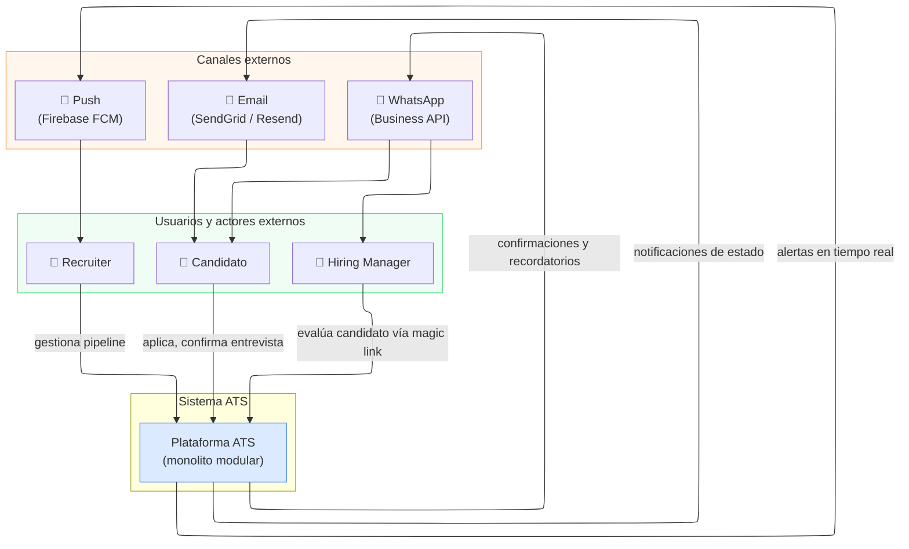

### Nivel 2 — Contenedores del Sistema

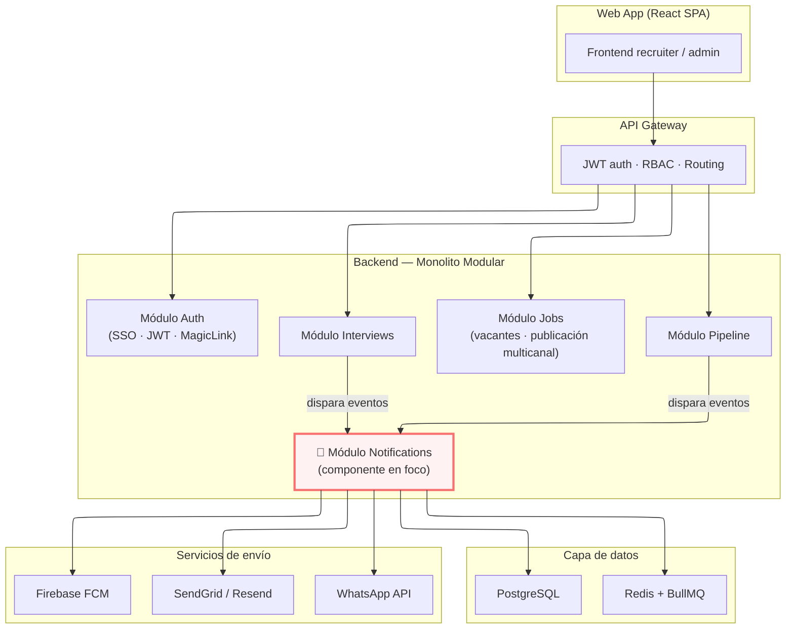

### Nivel 3 — Componentes del Módulo de Notificaciones

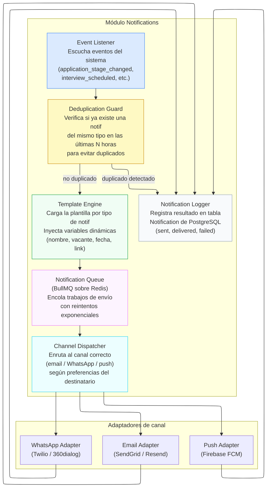

### Nivel 4 — Código: Notification Queue Worker

El componente de mayor complejidad interna es el **Queue Worker**, que procesa los trabajos de envío de forma asíncrona con manejo de errores, reintentos y logging.

```typescript
// notifications/queue/worker.ts

interface NotificationJob {
  notificationId: string;
  recipientType: 'candidate' | 'user';
  recipientId: string;
  channel: 'email' | 'whatsapp' | 'push';
  templateType: NotificationTemplateType;
  variables: Record<string, string>;
  attemptCount: number;
}

class NotificationWorker {
  // Procesa un trabajo de la cola BullMQ
  async process(job: NotificationJob): Promise<void> {
    const adapter = this.resolveAdapter(job.channel);

    try {
      // 1. Renderizar la plantilla con variables dinámicas
      const rendered = await this.templateEngine.render(
        job.templateType,
        job.variables
      );

      // 2. Enviar por el canal correspondiente
      const result = await adapter.send({
        recipientId: job.recipientId,
        content: rendered,
      });

      // 3. Registrar el resultado como enviado
      await this.logger.markSent(job.notificationId, result.externalId);

    } catch (error) {
      // 4. Reintentos con backoff exponencial (máx 3 intentos)
      if (job.attemptCount < 3) {
        const delayMs = Math.pow(2, job.attemptCount) * 1000; // 1s, 2s, 4s
        await this.queue.retryAfter(job, delayMs);
      } else {
        // 5. Marcar como fallido tras agotar reintentos
        await this.logger.markFailed(job.notificationId, error.message);
      }
    }
  }

  private resolveAdapter(channel: string): ChannelAdapter {
    const adapters = {
      email: this.emailAdapter,
      whatsapp: this.whatsappAdapter,
      push: this.pushAdapter,
    };
    return adapters[channel];
  }
}
```

**Decisiones de diseño del módulo:**
- La cola BullMQ sobre Redis desacopla el disparo del evento del envío efectivo, permitiendo que los módulos de Pipeline e Interviews no esperen a que se complete el envío.
- El Deduplication Guard evita que una candidatura reciba dos notificaciones del mismo tipo en corto tiempo (ej. dos recordatorios de entrevista por error del sistema).
- El backoff exponencial protege la tasa de envío ante picos de carga y respeta los rate limits de los proveedores externos.
- El registro completo en `Notification` permite auditoría, depuración y cálculo de métricas de entregabilidad por canal.

---

## 14. Conclusión Estratégica — Por Qué Este ATS Gana al Mercado

### La ventana estratégica

El mercado ATS tiene $3.1B en facturación anual con un CAGR proyectado del 8.1% hasta 2034. El 97.8% de las empresas Fortune 500 usa un ATS. Y sin embargo, el **68% de los usuarios reporta frustración** con su sistema actual.

Los líderes actuales (Greenhouse, iCIMS, Workday) resolvieron correctamente la organización del pipeline de candidatos pero **fallaron sistemáticamente en lo que más importa: la experiencia humana del proceso**.

### Nosotros vs. el mercado actual

| Dimensión | Mercado actual | Este ATS |
|---|---|---|
| Experiencia candidato | Formularios lentos, sin transparencia | 4 min, tracking en tiempo real, siempre respuesta |
| Adopción HM | Sistema complejo, baja adopción | Magic link, 3 botones, 30 segundos |
| IA | Feature de marketing, poco impacto real | Copiloto que ejecuta y aprende con datos propios |
| Analytics | Dashboards básicos, exportar a Excel | Por rol, accionables, con alertas automáticas |
| Integración HRIS | Campos básicos, sincronización parcial | Bidireccional profunda, todos los campos |
| Flexibilidad | La empresa se adapta al ATS | El ATS se adapta a la empresa |
| Pricing | Opaco, add-ons, penaliza crecimiento | Transparente, sin sorpresas, escala con éxito |

### Los 7 diferenciadores que hacen ganar

1. **Candidato en el centro** → Ataca pain #1 y #3 · NPS candidato objetivo >50
2. **HM Inbox (30 segundos)** → Ataca pain #2 · Time-to-hire -30% · Adopción HM >75%
3. **IA que ejecuta** → Ataca pain #8 · Elimina 40% de tareas administrativas
4. **Analytics accionables** → Ataca pain #5 · TA como función estratégica
5. **HRIS bidireccional profundo** → Ataca pain #4 · 3–5 horas ahorradas por contratación
6. **Workflows no-code** → Ataca pain #7 · Sin dependencia de IT · Alta flexibilidad
7. **Pricing transparente** → Ataca pain #6 · NRR objetivo >115%

### La tesis final

> Los ATS actuales construyeron herramientas para gestionar candidatos. Nosotros construimos una plataforma para que las empresas contraten mejor y los candidatos vivan el mejor proceso de su vida.

Esa diferencia de perspectiva — del sistema al ser humano — genera un producto 10x superior y un volante de crecimiento que se autorefuerza:

- Cada candidato satisfecho habla bien de la empresa y genera employer brand orgánico
- Cada recruiter que contrata más rápido demuestra ROI interno y renueva el contrato
- Cada hiring manager que decide en 30 segundos reduce el time-to-hire y la fricción del equipo
- Cada dato generado por el uso del producto hace la IA más precisa y el diferenciador más defendible

**El mercado está listo. Los usuarios están frustrados. La tecnología está disponible. La ventana está abierta.**

---

*Documento preparado por Senior Product Manager · Mayo 2026*
*Confidencial — Uso interno. No distribuir sin autorización.*
